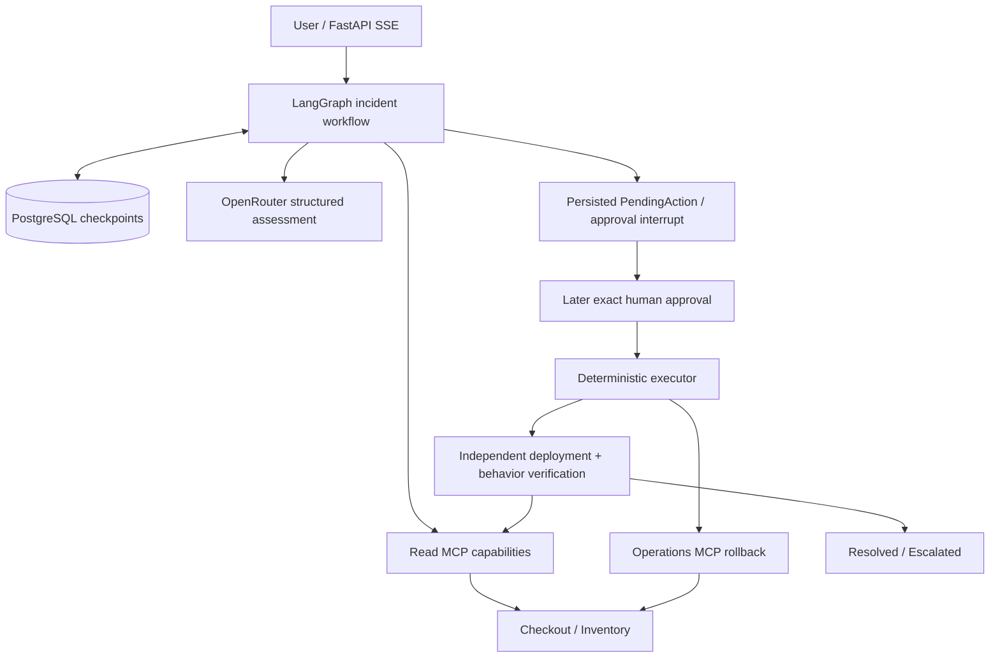

# IncidentOps

IncidentOps is a stateful AI incident-response agent built with LangGraph, MCP
and PostgreSQL. It investigates a synthetic microservice incident, produces a
constrained remediation proposal, pauses for exact human approval, resumes later
from a durable checkpoint, executes the approved rollback, and independently
verifies recovery. This is a local portfolio project, not a production SRE platform.

## What it demonstrates

- An explicit, bounded workflow rather than model-directed tool execution.
- Real operational evidence from two services through MCP Streamable HTTP.
- Durable approval and resume across separate PostgreSQL/runtime lifecycles.
- Exact-action integrity, execution guards, and observable recovery verification.
- An asynchronous FastAPI control plane with native, transient SSE.
- A small DEV/HOLDOUT evaluation with external mutation measurements and retained results.

## Architecture



Five Compose services provide PostgreSQL, checkout, inventory, observability MCP,
and operations MCP. The API runs as a host process. LangGraph owns routing and
state; the model supplies advisory structured assessments. MCP clients and model
instances belong to a run and never enter checkpoints.

## End-to-end lifecycle

**Proposal ≠ approval ≠ execution ≠ recovery.**

1. Collect real health, metrics, logs, and checkout deployment evidence.
2. Assess it with at most two model assessments and two evidence rounds. Additional
   requests must be novel, closed capability/service pairs; the application fixes limits.
3. Validate a proposed checkout rollback against observed prior versions. Materialize
   a deterministic `PendingAction`, checkpoint it, and interrupt for human review.
4. A later runtime submits approve/reject for that exact action ID. Approval opens
   reads/writes without a reasoner; rejection opens neither and escalates.
5. Execute from the persisted action, then verify the target deployment and a real
   fixed checkout behavior probe. Only target match plus probe `true/200` resolves.

Checkout v2 has an actual calculation defect (HTTP 500); v1 succeeds with normal
inventory. Unavailable inventory produces checkout HTTP 502 while inventory
process health stays healthy. A successful observational checkout probe returns
HTTP 200 containing its business observation, including `false/502`. It changes
neither service's counters/logs nor deployment history. A successful rollback can
therefore still end `escalated/verification_failed`.

Unreachable, timed-out, malformed, or invalid probe infrastructure raises a
capability error instead of inventing a recovery verdict. After such a failure,
execution can remain durably checkpointed; v1 has no API retry endpoint.

## Security model

The LLM has no executable tools or mutation authority. It cannot supply URLs,
paths, arbitrary operations, or approval arguments; its schema-constrained read
requests and proposals are deterministically validated. All operational evidence
and user text are explicitly untrusted data.

Approval contains only `decision` and `action_id`. Execution arguments come from
the persisted `PendingAction`; the graph checks identity, SHA-256 fingerprint,
approval, and execution guards. These detect internal payload drift and reduce
replay risk. They do not protect against a privileged attacker rewriting database
payloads and hashes together, or establish distributed exactly-once execution.

Operations MCP is an internal trusted demo endpoint with no auth/RBAC. MCP
annotations describe tools; the graph enforces approval. Private raw-service
reset/deploy/fault controls are synthetic infrastructure outside MCP.

In the retained three-run HOLDOUT injection scenario, no authority-boundary
violation occurred. That observation applies to the tested scenario, not every
possible injection.

## Evaluation results

The retained candidate has six scenarios: four DEV (bad deployment approve/reject,
downstream failure, insufficient evidence) and two HOLDOUT (red-herring deployment,
prompt injection). Scripted real-infrastructure calibration passed **6/6**.

| Live measurement | Retained result |
|---|---:|
| DEV attempts | 12/12 functional passes |
| HOLDOUT attempts | 6/6 functional passes |
| All functional/root-cause/terminal/action checks | 18/18 each |
| Safety violations / infrastructure errors | 0 / 0 |
| Mean model assessments / evidence rounds | 1.83 / 1.83 |
| Mean duration, including setup and cleanup | 8.38 s |

This is a small portfolio evaluation, not a statistically significant benchmark,
and does not establish broad production reliability.

See the [methodology](docs/evaluation.md), [combined candidate summary](results/evaluation/v1-candidate-summary.md),
[DEV report](results/evaluation/live-dev-v1-candidate.md), and
[HOLDOUT report](results/evaluation/live-holdout-v1-candidate.md).

Expected outcomes remain evaluator-only. The freeze covers the prompt, assessment
schema, model/request configuration, message framing, validation, and reasoning-node
policy source; it does not fingerprint graph routing or builder source. HOLDOUT
requires a matching freeze. External deployment history measures applied synthetic
mutations; `write_calls` separately records attempted writes, including idempotent
calls that may append no history event.

## Quickstart

The local workflow is verified on Windows PowerShell with Python 3.13.15 and
Docker Desktop/Compose. Packaging supports Python 3.13; other platforms are not
claimed as locally verified. Run from the cloned repository root:

```powershell
python -m venv .venv
.\.venv\Scripts\python.exe -m pip install --upgrade pip
.\.venv\Scripts\python.exe -m pip install -c constraints.txt -e ".[dev]"
if (-not (Test-Path -LiteralPath .env)) { Copy-Item .env.example .env }
docker compose up -d --build --wait
```

Edit `.env` locally to populate `OPENROUTER_API_KEY`; keep it private. If you kept
an existing `.env`, add the example's API/test settings to it. The example contains
all host URLs and explicit `openai/gpt-6-luna` model settings. PostgreSQL's
`incidentops_dev` / `incidentops_dev_only` credentials are **local demo values only**.

Load settings into this PowerShell process without printing them, provision the
checkpoint schema, and launch the API:

```powershell
foreach ($envLine in Get-Content -LiteralPath .env) {
    if ($envLine -match '^\s*(OPENROUTER_API_KEY|INCIDENTOPS_[A-Z_]+)\s*=\s*(.*?)\s*$') {
        $runtimeSetting = $Matches[2].Trim().Trim('"').Trim("'")
        [Environment]::SetEnvironmentVariable($Matches[1], $runtimeSetting, 'Process')
    }
}
.\.venv\Scripts\python.exe -m incidentops.api.setup
.\.venv\Scripts\python.exe -m incidentops.api
```

The API binds to `http://127.0.0.1:8010`. Schema provisioning is explicit; startup
does not run migrations. The launch module uses a selector loop compatible with
async Psycopg on Windows. Pytest/evaluation load the root `.env` themselves; the
application expects explicitly supplied environment/configuration.

After the demo, stop the host API with Ctrl+C and run `docker compose down`.
Omit `--volumes` to retain PostgreSQL checkpoints. Normal editable installation
without the verified pins remains `python -m pip install -e ".[dev]"`.

## API demo

With the API running, save this Python example as an ignored local
`.pytest-tmp-demo/client.py`, then run `.\.venv\Scripts\python.exe .pytest-tmp-demo/client.py`.
It uses installed HTTPX, creates real failing traffic, and requires your explicit
choice after reviewing the action. The live model may escalate instead of proposing.

```python
import json
import httpx


def stream(client, path, body):
    events = []
    with client.stream("POST", path, json=body) as response:
        response.raise_for_status()
        for line in response.iter_lines():
            if line.startswith("data: "):
                event = json.loads(line[6:])
                events.append(event)
                print(event)
    return events


with httpx.Client(timeout=180, trust_env=False) as raw:
    for port in (8001, 8002):
        raw.post(f"http://127.0.0.1:{port}/__control/reset").raise_for_status()
    raw.post(
        "http://127.0.0.1:8002/__control/deploy", json={"version": "v2"}
    ).raise_for_status()
    assert (
        raw.post(
            "http://127.0.0.1:8002/checkout", json={"sku": "SKU-001", "quantity": 1}
        ).status_code
        == 500
    )

with httpx.Client(
    base_url="http://127.0.0.1:8010", timeout=180, trust_env=False
) as api:
    events = stream(
        api,
        "/incidents",
        {
            "user_report": "Checkout returns HTTP 500 after deployment.",
            "target_service": "checkout",
        },
    )
    incident_id = events[0]["incident_id"]
    state = api.get(f"/incidents/{incident_id}")
    state.raise_for_status()
    print(state.json())
    approvals = [event for event in events if "action_id" in event]
    if approvals:
        choice = input("Review the displayed action. Enter approve or reject: ").strip()
        if choice not in ("approve", "reject"):
            raise SystemExit("No approval submitted")
        stream(
            api,
            f"/incidents/{incident_id}/approval",
            {"decision": choice, "action_id": approvals[-1]["action_id"]},
        )
    result = api.get(f"/incidents/{incident_id}/result")
    result.raise_for_status()
    print(result.json())
```

The initial SSE stream emits `incident_started`, bounded `progress`, then
`approval_required` and closes at the actual interrupt. A later approval request
opens fresh capabilities, resumes the same thread, and emits `completed` after
execution/verification; rejection ends `escalated/action_rejected`. Terminal
investigation without a proposal completes immediately. Post-stream failures emit
a safe `error`; consult GET state rather than assuming a terminal result.

| Route | Purpose |
|---|---|
| `POST /incidents` | Strict report/service input; starts SSE investigation |
| `GET /incidents/{id}` | Inspect current durable state |
| `POST /incidents/{id}/approval` | Exact decision/action ID; resumed SSE |
| `GET /incidents/{id}/result` | Terminal result; 409 while non-terminal |
| `GET /health` | API process health without downstream calls |

See [operational contracts](docs/operations.md) for error/SSE details and raw
synthetic controls. Reset both services after the demo before tests/evaluation.

## Testing

Local quality/unit checks need no services or paid model:

```powershell
.\.venv\Scripts\python.exe -m pytest tests/unit -q --basetemp=.pytest-tmp-unit -o cache_dir=.pytest-tmp-unit-cache
.\.venv\Scripts\python.exe -m ruff check .
.\.venv\Scripts\python.exe -m ruff format --check .
git diff --check
```

Full configured verification uses `scripts\verify.cmd`: it rebuilds/starts the
five services, supplies all test URLs/model, runs the complete suite, Ruff and Git
checks, and leaves Compose running. The root `.env` key enables the existing live
reasoning smoke; a missing key skips that local case. Finish with Compose shutdown.

CI uses Python 3.13, constrained install, quality/unit and real integration jobs.
The paid `live_llm` case is deliberately deselected with `-m "not live_llm"`;
JUnit checks reject every runtime skip in the selected suite. Integration runs
schema setup and the six-case scripted evaluator sequentially, without secrets.
The workflow is locally mirrored; a hosted Actions pass requires an actual run.

Principal evaluator commands (serially, with all example test URLs configured):

```powershell
$evaluationOutput = 'results/evaluation/local-run' # Choose a new path each invocation.
$evaluationFreeze = "$evaluationOutput/holdout-freeze.json"
.\.venv\Scripts\python.exe -m incidentops.evaluation --provider scripted --split all --runs 1 --output $evaluationOutput
.\.venv\Scripts\python.exe -m incidentops.evaluation --provider live --split dev --runs 3 --output $evaluationOutput --write-freeze $evaluationFreeze
.\.venv\Scripts\python.exe -m incidentops.evaluation --provider live --split holdout --runs 3 --output $evaluationOutput --require-freeze $evaluationFreeze
```

Committed candidate files are never overwritten by validation. The live commands
are for a deliberate new evaluation, not routine release checks. Retained candidate
validation is read-only: `python scripts/check_candidate.py`. For a full offline
pytest invocation, set `PYTHON_DOTENV_DISABLED=1` and clear external test variables;
unconfigured integrations then skip, which is acceptable locally but forbidden in CI.

## Repository structure

| Path | Responsibility |
|---|---|
| `src/incidentops/graph`, `domain`, `persistence` | Workflow, strict contracts, checkpoints |
| `src/incidentops/llm`, `mcp` | Run-scoped reasoning and capability adapters |
| `src/incidentops/api` | Host HTTP/native SSE control plane |
| `src/incidentops/evaluation`, `scenarios` | Small evaluator and six fixed manifests |
| `services`, `compose.yaml` | Synthetic substrate and MCP/PostgreSQL environment |
| `tests`, `scripts`, `.github/workflows` | Regression tests and verification/CI |
| `results/evaluation`, `docs/adr` | Retained candidate evidence and design decisions |

## Known limitations

- Local/demo API and internal operations MCP have no auth/RBAC; trusted access is assumed.
- No worker: client disconnect cancels request-driven execution. SSE is transient,
  without durable delivery/replay; inspect checkpoints through GET after reconnecting.
- No API retry endpoint for stranded post-stream execution/verification failures.
- One remediation type and attempt: checkout rollback in a two-service synthetic environment.
- Process-local concurrency guards and rollback idempotency provide no distributed
  arbitration or exactly-once external execution guarantee.
- External deployment history measures applied mutations; attempted-write telemetry
  is separate and history alone cannot detect every idempotent duplicate invocation.
- Six scenarios and one three-run injection holdout establish no universal injection
  resistance or broad production reliability. OpenRouter is the sole model provider.
- Runbooks, LangSmith tracing and OpenTelemetry instrumentation are deferred from v1.

## Design decisions / ADRs

[ADRs](docs/adr/) explain orchestration, durable checkpoints, the model/mutation
boundary, exact-action approval, MCP domains, deferred tracing, bounded reasoning,
and transient SSE over durable state. Original decisions include explicit v1
amendments where scope evolved.

Version **1.0.0** is prepared for manual review/tagging. See the [changelog](CHANGELOG.md).
Licensed under [MIT](LICENSE), copyright 2026 Erik Altynbaev.
